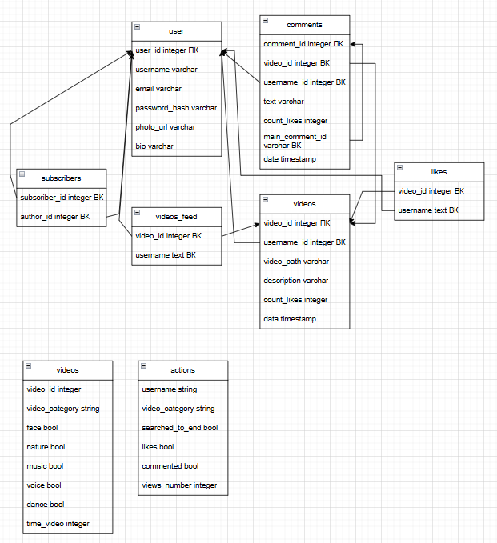
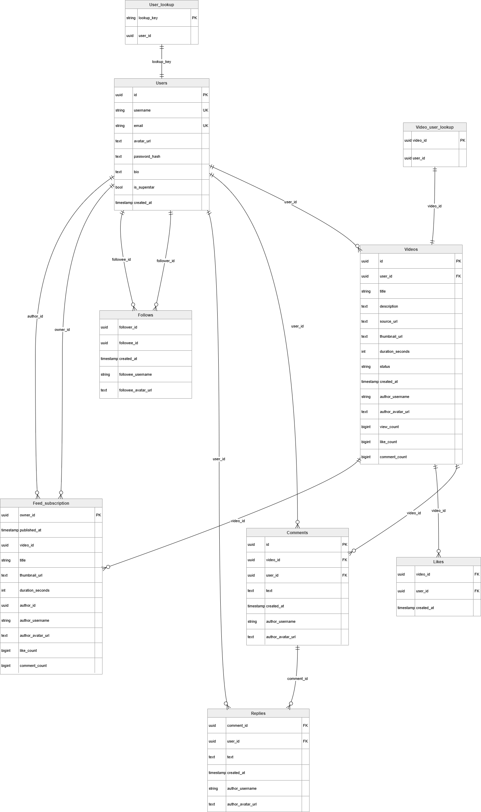
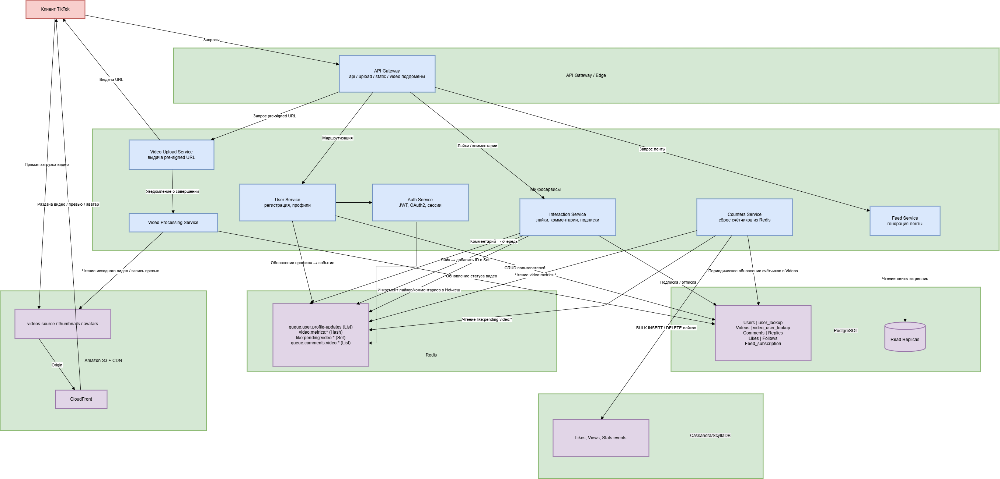

# TikTok

## 1. Тема и целевая аудитория

TikTok — сервис для создания и просмотра коротких видеороликов. Для каждого пользователя формируется персональная лента. Сервис популярен по всему миру.

### MVP

- Публикация видео
- Просмотр ленты
- Сбор статистики

###  Целевая аудитория

У TikTok 1,9 миллиарда активных пользователей по всему миру.
На 2026 год MAU =  1.9 млрд.
DAU оценивается от 875 млн до 954 млн человек.
Самое больше количество пользователей в США (136 млн), далее идут Индонезия (108 млн) и Бразилия (91.7 млн). Россия на 7 месте с 56 миллионами активных пользователей в месяц.
По миру люди тратят на TikTok в среднем 98 минут в день. В США люди тратят на TikTok в среднем 53,8 минуты в день [1].

Ежедневно приложение открывают 64% пользователей. Одна пользовательская сессия длится примерно 11 минут.
В минуту загружаются более 16000 новых видео (это 23 миллиона в день).
Средняя длина видео (2024): 42.7 секунды. Большая часть контента по-прежнему длится менее 1 минуты, но более длинные видеоролики (2-3 минуты) набирают популярность [2].

## 2. Расчет нагрузки

### Допущения и методы расчёта

Так как точные внутренние метрики TikTok недоступны, используются следующие обоснованные допущения:
1. Для значения DAU берём среднее значение из вашего найденного ранее диапазона - 920 млн (как 48.4% от MAU 1.9 млрд).
2. Активность пользователей.
По данным исследований, 64% MAU открывают приложение ежедневно — именно эта доля и формирует DAU. DAU совершают в среднем по 9 сессий (исходя из 98 минут в день и 11 минут на сессию: 98 / 11 ≈ 9 сессий в день).
В минуту пользователь просматривает в среднем 3-4 видео (с учётом средней длины видео 42.7 секунды и времени на пролистывание). Возьмём 3.5 видео/минуту.
3. Публикация видео.
Ежедневно загружается 23 млн новых видео.
Доля публикующих пользователей — 25% от активной аудитории [2].
4. Средний размер одного видео примем за 10 МБ (среднее качество, сжатие).

Источники и расчёт:
Согласно официальным требованиям и рекомендациям 2026 года, максимальный размер файла для загрузки варьируется в зависимости от устройства и типа контента: загрузка с мобильных устройств (iOS) до 287.6 МБ, загрузка с мобильных устройств (Android) до 72 МБ, загрузка с десктопа/веб-версии до 1 ГБ, рекламные видео до 500 МБ (это максимальные лимиты, а не средние значения).
Пользователи и платформа стремятся к балансу между качеством и скоростью загрузки/потребления. Аналитические сервисы и руководства для создателей контента указывают, что: средний размер видео для короткого клипа (до 60 секунд) в формате MP4 в хорошем качестве (1080p) обычно составляет от 5 до 15 МБ [3].

Метаданные, информация о видео (описание, автор, хештеги) - 1 КБ.
Данные о пользователе (профиль, подписки) - 10 КБ на пользователя.
Данные о взаимодействиях (лайк, комментарий, репост) - в среднем 0.5 КБ на действие.

### Результаты расчёта нагрузки

#### Продуктовые метрики
Метрика | Значение | Расчёт
:--- | :---: | :---:
Месячная аудитория (MAU) | 1 900 000 000 |
Дневная аудитория (DAU) | 920 000 000 | Среднее из оценки (875M - 954M)
Средний размер хранилища на пользователя |  |
Видео (в штуках) | 12.5 видео | Всего видео в системе / MAU. Всего видео (накоплено): возьмём за 3 года. (23 млн/день * 365 * 3) = ~25 млрд видео. 25 млрд / 1.9 млрд = ~13 видео.
Видео (в ГБ) | 0.125 ГБ (125 МБ) | 12.5 видео * 10 МБ
Метаданные (в КБ) | 12.5 КБ | 12.5 видео * 1 КБ
Среднее количество действий пользователя в день | |
Просмотр ленты (запросов) | 9 | Количество сессий в день (каждый вход = запрос ленты)
Просмотр видео (штук) | 343 | 98 мин/день * 3.5 видео/мин = 343 видео
Публикация видео | 0.025 | (23 млн новых видео / 920M DAU) ≈ 0.025 видео/пользователь/день. Среди активных авторов (25% от DAU) показатель выше (~0.1), но для средней нагрузки берём 0.025 по всей аудитории.
Лайк / Комментарий / Репост | 15 | Экспертная оценка на основе средней вовлечённости (2.5-6%) [2]. Примем, что пользователь взаимодействует с ~5% просмотренных видео. 343 * 0.05 ≈ 17.

#### Технические метрики
Хранилище данных (суммарно)
Тип данных | В штуках (приблизительно) | Размер | Расчёт
:--- | :---: | :---: | :---:
Видео | 25 млрд | 250 000 ТБ | 25 млрд шт * 10 МБ = 250 000 ТБ
Метаданные видео | 25 млрд | ~26 ТБ | 25 млрд шт * 1 КБ = ~25 600 ГБ ≈ 26 ТБ
Пользователи | 1.9 млрд | ~19 ТБ | 1.9 млрд * 10 КБ = ~19 000 ГБ ≈ 19 ТБ
Взаимодействия (лайки и т.д.) | 920M DAU * 15 = 13.8 млрд/день | Зависит от срока хранения, быстро растёт. Опустим для MVP |

Сетевой трафик
Тип трафика | Суточный объём (ТБ/сутки) | Пиковая нагрузка (Гбит/с) | Метод расчёта
:--- | :---: | :---: | :---:
Трафик отдачи видео (Download) | ~3 155 600 ТБ/сутки | ~1 402 000 Гбит/с | Суточный: 920M DAU * 343 видео * 10 МБ = ~3 155 600 ТБ. Средний трафик: 3 155 600 * 10⁹ байт / 86 400 с * 8 бит = ~292 000 Гбит/с. Пиковый: если 20% суточного объёма приходится на 1 час пик, то пик в 0.20 * 24 = 4.8 раза выше среднего -> ~1 402 000 Гбит/с. Этот трафик раздаётся CDN-узлами глобально.
Трафик загрузки видео (Upload) | ~230 ТБ/сутки | ~51 Гбит/с | Суточный: 23 млн видео * 10 МБ = 230 000 ГБ ≈ 230 ТБ. Пиковый: 10% объёма за 1 час -> коэффициент 0.10 * 24 = 2.4x от среднего -> ~51 Гбит/с.
Трафик метаданных / API | Маленький (<1% от видео-трафика) | - |

RPS (Requests Per Second)
Тип запроса | Средний RPS (тыс.) | Пиковый RPS (тыс.) | Метод расчёта (средний RPS)
:--- | :---: | :---: | :---:
Просмотр ленты | ~98 | ~245 | 920M DAU * 9 сессий / 86400 сек.
Просмотр видео | ~3 655 | ~9 138 | 920M DAU * 343 видео / 86400 сек. (Пик - коэффициент 2.5 от среднего).
Публикация видео | ~266 | ~665 | 23 млн видео / 86400 сек.
Лайк / Комментарий | ~160 | ~400 | 920M DAU * 15 действий / 86400 сек.
Сбор статистики | Зависит от внутренних задач. Можно оценить как 5-10% от запросов на видео. |

## 3. Глобальная балансировка нагрузки

### 3.1 Функциональное разбиение по доменам

Для разделения трафика по типам запросов и оптимизации балансировки используются отдельные доменные имена (или поддомены):
Домен | Назначение | Тип трафика
:--- | :--- | :---
api.tiktok.com | API-запросы (лента, лайки, комментарии и т.д.) | Динамический, низкая задержка
video.tiktok.com | Доставка видеоконтента | Тяжёлый, медиа
static.tiktok.com | Статика (CSS, JS, изображения) | Лёгкий, кешируемый
upload.tiktok.com | Загрузка видео | Тяжёлый, входящий трафик

### 3.2 Обоснование расположения дата-центров

Целевая аудитория TikTok распределена по всему миру, но наибольшая концентрация пользователей наблюдается в следующих регионах [1]:

Северная Америка (США – 136 млн MAU)

Латинская Америка (Бразилия – 91,7 млн MAU, Мексика – 57,5 млн MAU)

Юго-Восточная Азия (Индонезия – 108 млн MAU, Вьетнам – 54 млн MAU, Филиппины – 49 млн MAU)

Европа (Россия – 56 млн MAU, Великобритания – 27 млн MAU, Германия – 23 млн MAU, Франция – 24 млн MAU)

Остальной мир (Ближний Восток, Африка, Океания) – около 500–600 млн MAU.

Для обеспечения низкой задержки доступа и отказоустойчивости размещаем основные дата-центры в стратегических точках:

Северная Америка – Восточное побережье США (например, Северная Вирджиния) или Западное (Орегон). Охватывает США, Канаду.

Латинская Америка – Сан-Паулу (Бразилия). Обслуживает Бразилию и соседние страны.

Европа – Франкфурт (Германия) или Лондон. Покрывает Западную Европу, Россию (с некоторой задержкой) и часть Ближнего Востока.

Азия – Сингапур. Обслуживает Юго-Восточную Азию (Индонезия, Малайзия, Филиппины и др.).

### 3.3 Механизм регулировки трафика между ДЦ

Для динамического управления нагрузкой и отказоустойчивости в проекте предполагается использовать GeoDNS. DNS-сервер предоставляет возможность использовать базу данных GeoIP2 для определения географического положения клиента. Таким образом, DNS сервер используя GeoIP, будет предоставлять различные IP-адреса в ответ на запросы от клиентов в зависимости от их физического местоположения.

Для обеспечения непрерывности работы при выходе из строя одного из дата-центров: GeoDNS-сервер автоматически исключает IP-адрес недоступного ДЦ из ответов. Вместо него возвращается адрес ближайшего работающего ДЦ (или резервного). Например, при падении ДЦ во Франкфурте, DNS для европейских пользователей начинает возвращать IP-адрес Лондонского ДЦ или другого, с наименьшей задержкой. Время обнаружения сбоя – не более 30–60 секунд.

## 4. Локальная балансировка нагрузки

Для расчётов взят ДЦ в Северной Америке, который принимает около 25% глобального трафика. Аналогичные вычисления применимы к другим ДЦ с поправкой на их долю.

### 4.1 Схема балансировки нагрузки

Внутри ДЦ используется двухуровневая схема балансировки:
- уровень L4 – принимает весь входящий трафик от пользователей (или от глобальных балансировщиков) и распределяет его между балансировщиками уровня L7. Также может выполнять простую маршрутизацию по номерам портов для разных типов трафика;

- уровень L7 – выполняет SSL termination, маршрутизацию по поддоменам (api.tiktok.com, upload.tiktok.com, static.tiktok.com), балансировку запросов на бекенд-сервисы (серверы приложений, базы данных, объектное хранилище).

Для обоих уровней применяется схема active‑active. При выходе одного узла из строя трафик автоматически перенаправляется на остальные работающие узлы. Формула резервирования – N+1: на N рабочих узлов приходится 1 резервный, который в обычном режиме также активен и участвует в распределении нагрузки (избыточность по мощности). Это позволяет выдерживать отказ одного узла без потери пропускной способности.

### 4.2 Расчёт количества балансировщиков

Исходные данные для ДЦ в США (доля 25% от глобальных метрик)
Тип запроса | Средний RPS (глобальный) | Пиковый RPS (глобальный, коэф. 2.5) | Пиковый RPS на ДЦ (25%)
:--- | :--- | :--- | :---
Просмотр ленты | 98 000 | 245 000 | 61 250
Публикация видео | 266 000 | 665 000 | 166 250
Лайк / комментарий | 160 000 | 400 000 | 100 000
Статика (CSS, JS, иконки) | ≈ 10 000 (оценка) | 25 000 | 6 250
Итого | 534 000 | 1 335 000 | 333 750

Согласно тестам производительности nginx [4], при включённом SSL Termination (HTTPS) на современных 8-ядерных серверах можно достичь 50 000 RPS на один экземпляр. Это примерная оценка, учитывающая накладные расходы на расшифровку, проверку сертификатов и логирование.

#### Расчёт количества L7 балансировщиков

Необходимое количество рабочих узлов (без учёта резерва):
Nwork = 333 750 / 50 000 = 6,675 = 7

Применяем формулу резервирования N + 1 (один дополнительный узел для отказоустойчивости):
Ntotal = 8

Итого для уровня L7 нужно 8 балансировщиков nginx, работающих в режиме active‑active. При отказе любого одного из них оставшиеся 7 продолжат обслуживать пиковую нагрузку (7 * 50 000 = 350 000 RPS, что выше требуемых 333 750).

#### Расчёт количества L4 балансировщиков

Ограничивающие факторы:
- API-трафик: средний размер HTTP-запроса к API составляет около 1–2 КБ. Пиковый трафик API на L4 (ДЦ США): 333 750 RPS * 2 КБ ≈ 667 МБ/с ≈ 5,3 Гбит/с.
- Видеопоток (Download): пиковый глобальный трафик ~1 402 000 Гбит/с. Доля ДЦ США (25%) = ~350 500 Гбит/с. Этот трафик преимущественно обслуживается CDN-узлами, минуя основной L4-балансировщик. Через L4 проходят лишь запросы к API и Upload (~0,1% от видеотрафика, фактически только метаданные).
- Upload-трафик: 25% от глобального пикового Upload (~51 Гбит/с) = ~13 Гбит/с на ДЦ США.
- Итого через L4 (без CDN видео): ≈ 5,3 + 13 ≈ 18,3 Гбит/с.

Один L4-балансировщик с 40-гигабитным интерфейсом легко обрабатывает такой поток. Для покрытия 18,3 Гбит/с достаточно одного рабочего узла. Применяем схему active‑active с N+1 резервированием, N ≥ 2 (минимум 3 узла):
- 2 активных узла обслуживают трафик в штатном режиме.
- 1 резервный узел в режиме active‑active готов принять нагрузку при отказе любого из двух.
- При выходе одного узла оставшиеся 2 покрывают расчётные 18,3 Гбит/с.

Итого для уровня L4 нужно 3 балансировщика (active‑active, N+1 с N=2).

## 5. Логическая схема БД

### Описание таблиц
Таблица | Назначение | Поля | Связи
:--- | :--- | :--- | :-- |
User | Пользователи сервиса | id (PK), username (UK), email (UK), avatar_url, password_hash, bio, created_at, is_superstar (флаг >100k подписчиков) | Один ко многим с Video, Follow, Comment, Reply, Like, Feed_subscription
Follow | Подписки | follower_id (FK -> User.id), followee_id (FK -> User.id), created_at, followee_username (денорм.), followee_avatar_url (денорм.) | Составной PK (follower_id, followee_id)
Video | Метаданные видео | id (PK), user_id (FK -> User.id), title, description, source_url, thumbnail_url, duration_seconds, status (processing/published/deleted), created_at, author_username (денорм.), author_avatar_url (денорм.), view_count, like_count, comment_count | Связана с User (автор), Comment, Reply, Like, Feed_subscription
Comment | Комментарии к видео | id (PK), video_id (FK -> Video.id), user_id (FK -> User.id), text, created_at, author_username (денорм.), author_avatar_url (денорм.) | Один ко многим: видео -> комментарии
Reply | Ответы на комментарии | comment_id (FK -> Comment.id), user_id (FK -> User.id), text, created_at, author_username (денорм.), author_avatar_url (денорм.) | Связана с Comment (родитель)
Like | Лайки пользователей на видео | user_id (FK -> User.id), video_id (FK -> Video.id), created_at | Составной PK (user_id, video_id)
Feed_subscription | Персональная лента (прекомпьютированная) | owner_id (FK -> User.id), published_at, video_id, title, thumbnail_url, duration_seconds, author_id, author_username, author_avatar_url, like_count, comment_count | Денормализованная таблица для быстрой выдачи ленты

### Размеры данных
#### Объём строк в таблицах
Таблица | Количество строк | Примечание
:--- | :--- | :---
User | 1.9 млрд | По числу MAU
Follow | ~100 млрд | В среднем 50 подписок на пользователя
Video | 25 млрд | Накоплено за ~3 года (23 млн/день)
Comment | ~500 млрд | В среднем 20 комментариев на видео (25 млрд * 20)
Reply | ~250 млрд | Оценка 0.5 ответа на комментарий
Like | 920M DAU * 15 лайков/день * 365 дней = ~5 трлн (хранятся ограниченное время) | Для расчёта возьмём накопленные за 1 год ≈ 1.8 трлн
Feed_subscription | 920 млн * 100 видео в ленте = 92 млрд | Лента содержит ~100 свежих записей на пользователя

#### Размер одной строки (байт)
Таблица | Приблизительный размер строки | Расчёт
:--- | :--- | :---
User | 350 байт | UUID (16) + username(50) + email(320) + avatar_url(512) + hash(72) + bio(500) + timestamps(16) + bool(1) ≈ 1487, с учётом переменных полей и сжатия ~350
Follow | 200 байт | два FK (по 16) + timestamp (8) + два денорм. поля (username 50 + avatar_url 512) -> ~602, с учётом сжатия ~200
Video | 350 байт | UUID(16) + title(255) + description(2200) + status(16) + timestamp(8) + source_url(512) + thumbnail_url(512) + duration(4) + author_username(50) + author_avatar_url(512) + три счётчика(24) ≈ 4109 (в основном за счёт TEXT полей, хранятся отдельно), fixed part ~350
Comment | 280 байт | UUID(16) + FK(16) + FK(16) + text(2200) + timestamp(8) + author_username(50) + author_avatar_url(512) ≈ fixed part ~280
Reply | 260 байт | Аналогично Comment
Like | 40 байт | два UUID(16) + timestamp(8) = 40
Feed_subscription | 350 байт | owner_id(16), published_at(8), video_id(16), title(255), thumbnail_url(512), duration(4), author_id(16), author_username(50), author_avatar_url(512), два счётчика(16) ≈ 1405, сжатие ~350

#### Общий размер хранилища (только БД, без видео)

Расчёт глобальный (все ДЦ, все пользователи). RPS в разделах также глобальные.

Таблица | Строк | Размер строки (байт) | Итого
:--- | :--- | :--- | :---
User | 1,9 млрд | 350 | ~665 ГБ
Follow | 100 млрд | 200 | ~20 ТБ
Video | 25 млрд | 350 | ~9 ТБ
Comment | 500 млрд | 280 | ~140 ТБ
Reply | 250 млрд | 260 | ~65 ТБ
Like | 1 800 млрд | 40 | ~72 ТБ
Feed_subscription | 92 млрд | 350 | ~32 ТБ
Всего | | | ~339 ТБ

### Нагрузка на чтение/запись (QPS)
Операция | Таблицы | Тип | Средний QPS | Пиковый QPS (x2.5)
:--- | :--- | :--- | :--- | :---
Просмотр ленты | Feed_subscription (чтение) | Чтение | 98 000 | 245 000
Просмотр видео (метаданные) | Video (чтение) | Чтение | 3 655 000 | 9 137 500
Публикация видео | Video (вставка), Feed_subscription (вставка для подписчиков) | Запись | 266 000 | 665 000
Лайк видео | Like (вставка), Video (обновление like_count) | Запись | 160 000 | 400 000
Комментарий | Comment (вставка), Video (обновление comment_count) | Запись | 50 000 | 125 000
Ответ на комментарий | Reply (вставка) | Запись | 25 000 | 62 500
Подписка/отписка | Follow (вставка/удаление) | Запись | 10 000 | 25 000

### Требования к консистентности
Сущность / операция | Требование | Обоснование
:--- | :--- | :---
Регистрация, подписка | Strong consistency | Безопасность и целостность данных пользователя. Нельзя, чтобы подписка пропала после подтверждения
Лайки и счётчики | Eventual consistency (слабая) | Допустима задержка обновления счётчиков (несколько секунд). Высокая нагрузка требует асинхронной обработки
Лента (Feed_subscription) | Eventual consistency с гарантией доставки в течение 1-2 секунд | Новое видео может появиться в ленте не мгновенно, но должно появиться у всех подписчиков
Комментарии | Strong consistency для только что опубликованного комментария (чтобы автор видел его сразу), eventual для остальных | Пользователь ожидает увидеть свой комментарий сразу

### Особенности распределения нагрузки по ключам
Для горизонтального масштабирования ключи выбираются так, чтобы равномерно распределять нагрузку и обеспечить локальность данных.

Таблица | Ключ шардирования | Обоснование
:--- | :--- | :---
User | id (хеш) | Равномерное распределение; для поиска по username/email используется user_lookup
Follow | follower_id | Все подписки пользователя на одном шарде
Video | user_id | Видео одного автора на одном шарде; для поиска по id используется video_user_lookup
Comment, Reply | video_id (хеш) | Все комментарии к видео локально
Like | video_id | Все лайки видео на одном шарде
Feed_subscription | owner_id | Лента пользователя на одном шарде

## 6. Физическая схема БД

### Общая архитектура хранения.

Таблицы БД описывают глобальный объём данных. Расчёт RPS также глобальный. Раздел 11 (Расчёт ресурсов) выполнен для ДЦ в США (25% от глобальных метрик), что отражено явно в каждой таблице. Данные шардируются и распределяются по всем ДЦ, каждый из которых хранит свою долю.

- PostgreSQL (шардированный) — основные оперативные данные: пользователи, видео, комментарии, подписки, лента подписок. Каждая таблица шардирована. У шардов есть реплики, чтобы разгружать нагрузку на чтение.
- Cassandra/ScyllaDB — высоконагруженные таблицы взаимодействий: лайки, счётчики просмотров, события статистики.

### Обоснование выбора СУБД

Посмотрим на нагрузку по таблицам (пиковый глобальный QPS из раздела 5):

Таблица | Пиковый QPS записи | Пиковый QPS чтения
:--- | :--- | :---
Video (метаданные) | — | 9 137 500
Feed_subscription | 665 000 (вставка) | 245 000
Like | 400 000 | —
Comment | 125 000 | —
User/Follow | 25 000 | умеренно

При 100 шардах PostgreSQL нагрузка на один шард Video: 9 137 500 / 100 = 91 375 QPS чтения. PostgreSQL master + 2 реплики выдерживают ~50 000–100 000 RPS при простых точечных запросах. Для Like (400 000 QPS записи) PostgreSQL не подходит: реляционная БД с WAL и MVCC создаёт существенный overhead на write-heavy нагрузку.

СУБД | Таблицы | Обоснование
:--- | :--- | :---
PostgreSQL (Aurora) | Users, Follows, Video, Comments, Replies, Feed_subscription | ACID-транзакции, строгая консистентность для профилей и подписок. Нагрузку на чтение Video снижает Redis-кеш: 90%+ запросов к горячим видео идут в Redis, реальная нагрузка на PostgreSQL ≈ 913 750 / 100 шардов ≈ 9 137 RPS/шард — достижимо
Cassandra/ScyllaDB | Likes, события просмотров, статистика | 400 000 QPS записи и ~1,8 трлн строк. LSM-дерево даёт O(1) запись, горизонтальное масштабирование без ручного шардирования, eventual consistency достаточна для лайков
Redis | Горячие счётчики, кеш ленты, буфер лайков | Буферизует 90%+ чтений Video, все инкременты просмотров и лайков до сброса в основную БД, что снимает пиковую нагрузку с обеих СУБД

### Основные таблицы PostgreSQL.

#### Users.

##### Поля:
- id UUID PRIMARY KEY DEFAULT gen_random_uuid()
- username VARCHAR(50) NOT NULL
- password_hash VARCHAR(255) NOT NULL -- хэш от bcrypt/Argon2
- email VARCHAR(320) NOT NULL -- RFC 5321: local(64) + @ + domain(255) = max 320
- avatar_url TEXT
- bio TEXT
- is_superstar BOOL DEFAULT FALSE -- устанавливается в true при достижении 100к подписчиков
- created_at TIMESTAMPTZ DEFAULT NOW()

##### Индексы:
- users_pkey (PRIMARY KEY, btree по id) — для поиска по ID.
- users_username_key UNIQUE (btree по username) — для логина, проверки уникальности при регистрации.
- users_email_key UNIQUE (btree по email) — для входа по email, восстановления пароля.

##### Технологии:
- Обновлении username или avatar_url требует обновления денормализованные копии в других таблицах. (Для этого можно использовать очередь в Redis)

##### Шардирование:
- Шардирование: по id (хеш-шардирование). Это дает равномерное распределение, но запросы по username или email требуют поиска по всем шардам.
- Для оптимизации используется отдельная lookup-таблица user_lookup(username/email -> id), шардированную по хешу от username/email.

#### Videos.

##### Поля:
- id UUID PRIMARY KEY DEFAULT gen_random_uuid()
- user_id UUID NOT NULL REFERENCES users(id)
- title VARCHAR(255)
- description TEXT
- source_url TEXT -- ссылка на исходный файл в S3
- thumbnail_url TEXT -- ссылка на превью в S3
- duration_seconds INT
- status VARCHAR(20) CHECK (status IN ('processing', 'published', 'deleted'))
- created_at TIMESTAMPTZ DEFAULT NOW()
- author_username VARCHAR(50) -- копия из users
- author_avatar_url TEXT -- копия из users
- view_count BIGINT DEFAULT 0
- like_count BIGINT DEFAULT 0
- comment_count BIGINT DEFAULT 0

##### Индексы:

- videos_pkey (btree по id) — поиск видео по ID.
- videos_user_created_idx (btree по user_id, created_at DESC) — критически важный индекс для получения видео пользователя (профиль).
- videos_status_idx (btree по status) WHERE status = 'published' — для отбора опубликованных видео.

##### Денормализация:
- Поля автора (author_username, author_avatar_url) избыточны, чтобы избежать JOIN с users при отображении карточки видео.
- Счетчики (view_count, like_count, comment_count) денормализованы, так как часто запрашиваются вместе с видео.

##### Технологии:
- Status фильтруется на стороне backend.
- Видео со статусом 'deleted' чистятся фоново группами.
- Status 'published' устанавливается после загрузки видео в S3.
- Первичное обновление счетчиков идет в Redis, а в PostgreSQL они обновляются периодически (раз в 30 секунд).

##### Шардирование:
- Шардирование по user_id (автору). Это позволяет запросы "все видео автора" выполнять в пределах одного шарда.
- Если у юзера установлен флаг is_superstar, используется отдельный шард.
- Однако запрос конкретного видео по id используется lookup-таблица video_user_lookup (video_id -> user_id) шардированная по video_id.

#### Comments.

##### Поля:

- id UUID PRIMARY KEY DEFAULT gen_random_uuid()
- video_id UUID NOT NULL
- user_id UUID NOT NULL
- text TEXT
- created_at TIMESTAMPTZ DEFAULT NOW()
- author_username VARCHAR(50)
- author_avatar_url TEXT

##### Индексы:
- comments_video_created_idx (btree по video_id, created_at DESC) — основной индекс для списка комментариев под видео.

##### Денормализация:
- Имя и аватар автора продублированы, чтобы избежать JOIN с users.

##### Технологии:
- Для популярных видео комментарии сначала попадают в очередь Redis, а чтение направлять на read-реплики.

##### Шардирование:
Шардирование по video_id. Это локализует все комментарии одного видео на одном шарде.

#### Replies.

##### Поля:
- comment_id UUID NOT NULL
- user_id UUID NOT NULL
- text TEXT
- created_at TIMESTAMPTZ DEFAULT NOW()
- author_username VARCHAR(50)
- author_avatar_url TEXT

##### Индексы:
- replies_comment_created_idx (btree по comment_id, created_at ASC) — для вывода ответов к комментарию в хронологическом порядке.

##### Денормализация:
- Имя и аватар автора продублированы, чтобы избежать JOIN с users.

##### Шардирование:
По comment_id.

#### Likes.

##### Поля:
- user_id UUID NOT NULL
- video_id UUID NOT NULL
- created_at TIMESTAMPTZ DEFAULT NOW()

##### Индексы:
- likes_pkey (btree по video_id, user_id) — покрывает запрос проверки лайка конкретным пользователем.

##### Технологии:
- Вставка и удаление лайка — частые операции. Чтобы не нагружать PostgreSQL, операции сначала попадают в Redis (Set), а затем асинхронно синхронизируются через bulk insert/delete.

##### Шардирование:
По video_id. Это локализует все лайки видео на одном шарде.

#### Follows.

##### Поля:
- follower_id UUID NOT NULL
- followee_id UUID NOT NULL
- created_at TIMESTAMPTZ DEFAULT NOW()
- followee_username VARCHAR(50) -- для отображения списка подписок без JOIN
- followee_avatar_url TEXT

##### Индексы:
- follows_pkey (btree по follower_id, followee_id) — "на кого подписан пользователь".
- follows_followee_follower_idx (btree по followee_id, follower_id) — второй индекс для запроса "кто подписан на пользователя".

##### Денормализация:
- followee_username и followee_avatar_url позволяют отобразить список подписок пользователя без JOIN с users.

##### Шардирование:
По follower_id. Это оптимально для запроса подписок пользователя. Запрос подписчиков (followee_id) будет кросс-шардным (не самый частый запрос).

#### Feed_subscription.

##### Поля:
- owner_id UUID NOT NULL -- пользователь, чья лента
- published_at TIMESTAMPTZ NOT NULL -- время публикации видео
- video_id UUID NOT NULL
- title VARCHAR(255)
- thumbnail_url TEXT
- duration_seconds INT
- author_id UUID
- author_username VARCHAR(50)
- author_avatar_url TEXT
- like_count BIGINT
- comment_count BIGINT

##### Индексы:
- feed_subscription_pkey (btree по owner_id, published_at DESC, video_id) — основной индекс для пагинированного чтения ленты.

##### Денормализация:
- Содержит все данные, необходимые для рендеринга карточки видео в ленте. Не требует JOIN при чтении ленты.

##### Технологии:
- Для обычных пользователей видео попадает в отдельную ленту.
Для пользователей с установленным флагом is_superstar — видео не записывается в ленты подписчиков.
Последние видео популярных пользователей запрашиваются отдельно через обращение к таблице videos.
- Счетчики like_count, comment_count периодически обновляются фоновым процессом из таблицы videos.

##### Шардирование:
По owner_id.

### Вспомогательные таблицы PostgreSQL.

#### Таблица video_user_lookup (для поиска видео по ID)

##### Поля:
- video_id UUID PRIMARY KEY
- user_id UUID NOT NULL

##### Назначение:
При запросе видео по id сначала ищем в этой таблице, чтобы узнать user_id (ключ шардирования), затем запрашиваем нужный шард.

##### Шардирование
По video_id.

#### Таблица user_lookup (для поиска пользователя по username/email)

##### Поля:
- lookup_key VARCHAR(255) PRIMARY KEY (например, "username:alice" или "email:alice@example.com")
- user_id UUID NOT NULL

##### Шардирование:
По lookup_key (хеш). Используется для быстрого определения id пользователя без сканирования всех шардов users. Запросы логина/регистрации идут сначала сюда.

### Redis.
| Ключ                                      | Тип данных   | Назначение                                                                                                                               | TTL / Срок жизни        | Примечания                                                                                                                                  |
|-------------------------------------------|--------------|------------------------------------------------------------------------------------------------------------------------------------------|-------------------------|----------------------------------------------------------------------------------------------------------------------------------------------|
| `queue:user:profile-updates`              | List         | Очередь событий обновления профиля пользователя. При изменении `username` или `avatar_url` в таблице `users` сюда добавляется задача.     | Бессрочно (очищается consumer'ом) | Consumer читает задачи и обновляет денормализованные поля (`author_username`, `author_avatar_url`) в таблицах `videos`, `comments`, `replies`, `follows`. |
| `video:metrics:{video_id}`                | Hash         | Горячие счётчики видео. Поля: `views`, `likes`, `comments`. Атомарный инкремент при каждом просмотре / лайке / комментарии.                 | Бессрочно               | Периодически (например, раз в 30 секунд) фоновый воркер сбрасывает накопленные значения в таблицу `videos` через `UPDATE ... SET count = count + delta`. |
| `like:pending:video:{video_id}`           | Set          | Временное хранилище ID пользователей, поставивших лайк видео `video_id`, до момента асинхронной вставки в PostgreSQL.                      | ~30 секунд (до обработки) | Воркер периодически собирает накопившиеся `user_id` из Set'ов, выполняет `BULK INSERT` в таблицу `likes` и очищает Set. Обеспечивает идемпотентность. |
| `queue:comments:video:{video_id}`         | List         | Очередь комментариев для популярных видео (у автора установлен флаг `is_superstar`). Новый комментарий сначала кладётся в очередь.         | Бессрочно (очищается consumer'ом) | Consumer читает очередь и вставляет комментарии в таблицу `comments` пачками. Чтение комментариев при этом идёт с read-реплик PostgreSQL.           |

### Amazon S3 — хранение файлов

#### Бакеты:
- videos-source — исходные загруженные видео.
- thumbnails — превью видео.
- avatars — аватарки пользователей.

##### Технологии:
- Прямая загрузка с клиента через pre-signed URL, чтобы не нагружать бэкенд.
- CDN (CloudFront) для статики.

## 7. Алгоритмы

### 7.1 Формирование персонализированной ленты
Для каждого из 920 млн DAU сформировать персонализированную ленту из видеороликов, которая максимизирует время просмотра и удержание пользователя. Лента должна обновляться при каждой прокрутке (бесконечный скроллинг), время формирования следующего батча — не более 200–300 мс.

Ключевое отличие TikTok от платформ на основе social graph (Instagram, Facebook) в том, что лента строится не вокруг подписок, а на основе предсказания того, какой контент пользователь с наибольшей вероятностью досмотрит до конца — независимо от того, подписан он на автора или нет.

Входные данные:
- Профиль пользователя (история взаимодействий, демографические данные, геолокация, язык).
- Пул доступных видео (25 млрд единиц).
- Актуальные тренды и популярные звуки/хештеги.

Ограничения:
- Время формирования батча (20–50 видео) — не более 300 мс.
- Пиковая нагрузка на сервис ленты — 9,1 млн RPS.
- Cистема должна учитывать свежесть контента и избегать повторяющихся рекомендаций.

Требования к результату: ранжированный список видео, отсортированный по предсказанной релевантности для текущего пользователя в данный момент времени.

### 7.2 Публикация видео и обработка контента
Принять видеофайл, выполнить транскодирование, модерацию, сохранить метаданные и файлы, сделать видео доступным. Время от загрузки до доступности — не более 30–60 секунд.

Входные данные: видеофайл, метаданные (название, описание, хештеги), ID пользователя.
Ограничения: пиковая нагрузка 665 тыс. видео/с глобально.
Требования: автоматическая модерация до публикации, адаптивные версии видео.

### 7.3 Сбор и агрегация статистики (лайки, просмотры, репосты)
Обработать поток действий пользователя (просмотр видео, лайк, комментарий) с пиковой интенсивностью 9,1 млн событий в секунду, агрегировать счётчики по каждому видео и сохранить итоговые значения в БД с допустимой задержкой (eventual consistency, 1–30 секунд).

Исходные данные, ограничения, требования
Входные данные: события (user_id, video_id, action_type, timestamp).
Ограничения: 9,1 млн событий/с, eventual consistency.
Требования: получение текущих значений счётчиков с минимальной задержкой.

## 8. Технологии

Технология | Область применения | Мотивационная часть
:--- | :--- | :---
Go (Golang) | Бэкенд-сервисы (API Gateway, лента, рекомендации, обработка публикаций) | Go обеспечивает высокую производительность при низком потреблении памяти. Goroutine-модель позволяет выдерживать десятки тысяч конкурентных соединений с минимальными накладными расходами (~2 КБ на горутину). Внутренние тесты TikTok показывают, что Go-сервисы демонстрируют CPU-эффективность на 37% выше по сравнению с аналогами на других языках при равной нагрузке. Статическая компиляция упрощает деплой в контейнерных средах, а встроенные профилировщик и трейсер облегчают отладку производительности.
API Gateway | Входная точка для всех клиентских запросов, аутентификация, rate limiting, маршрутизация, сбор метрик | Типовые gateway-решения (Kong, Envoy) вносят дополнительные задержки из-за архитектуры цепочек плагинов. TikTok реализовал собственный Gateway, который с помощью eBPF-программ в XDP-слое ядра обрабатывает до 70% решений (аутентификация, rate limiting, geo-маршрутизация) до того, как пакет достигнет стека протоколов. Это позволило снизить задержку первого байта на 41% и достичь ~420k QPS на узел (против ~80k у Envoy).
CDN (собственная / Open Connect) | Доставка видеоконтента и статики конечным пользователям | Основной трафик TikTok — видеопросмотры. CDN доставляет видео с узлов, максимально приближенных к пользователю, что критически снижает задержки. Netflix, имея схожие паттерны трафика, эксплуатирует собственную CDN Open Connect с серверами, размещёнными непосредственно у провайдеров: 15 000+ узлов, каждый с пропускной способностью до 18 Гбит/с. Аналогичный подход позволяет уменьшить расходы на межоператорский трафик и повысить качество обслуживания.
Kafka | Потоковая обработка событий, асинхронное обновление лент (fan-out), агрегация метрик вовлечённости, очереди для видео-транскодинга | При публикации видео необходимо разослать запись в ленты миллионов подписчиков. Kafka предоставляет надёжное, партиционированное и масштабируемое хранилище событий с возможностью воспроизведения при сбоях. Такая архитектура (fan-out on write) позволяет разгрузить базу данных от массовых вставок: публикация порождает одно сообщение в Kafka, а пул консьюмеров асинхронно «размножает» его в feed-хранилища подписчиков. ShareChat (180 млн MAU) обрабатывает 370–440k операций в секунду через Kafka-стримы.
Redis | Кеширование (ленты, популярные видео, сессии), буферизация счётчиков (video:metrics:{video_id}), очереди обновления денормализованных полей (queue:user:profile-updates), временное хранилище лайков (like:pending:video:{video_id}), очереди комментариев для суперзвёзд (queue:comments:video:{video_id}) |Redis обеспечивает микрозадержки и богатый набор структур. Использование Redis позволяет сократить число обращений к БД на 90% и выше, а также организовать асинхронную пакетную запись в PostgreSQL
PostgreSQL (Amazon Aurora) | Реляционные данные: Users, Videos, Comments, Replies, Follows, Feed_subscription, а также lookup-таблицы user_lookup и video_user_lookup | Пользовательские профили и отношения подписки требуют транзакционной согласованности и поддержки ACID. Aurora обеспечивает автоматическую репликацию, отказоустойчивость и масштабирование хранилища без даунтайма. Реальная нагрузка на PostgreSQL по читаемым таблицам снижена Redis-кешом до приемлемых ~9 000 RPS/шард.
Cassandra/ScyllaDB | Высоконагруженные таблицы взаимодействий: Likes (~400 000 QPS записи), просмотры, события статистики | SQL-базы с MVCC создают overhead на write-heavy операции. Cassandra с LSM-деревом обеспечивает O(1) запись и горизонтальное масштабирование без ручного шардирования. Eventual consistency достаточна для лайков и счётчиков.
Elasticsearch | Поиск видео по хештегам, тексту описания, названию | Полнотекстовый поиск среди 25 млрд видео требует индексации и быстрого выполнения сложных запросов. Elasticsearch обеспечивает распределённый поиск в реальном времени, поддержку синонимов и нечёткого поиска, а также масштабируется горизонтально через шардирование индексов.
S3-совместимое объектное хранилище (MinIO / AWS S3) | Хранение оригинальных и транскодированных видеофайлов, аватаров пользователей, превью | Видеофайлы — основной по объёму тип данных (250 ПБ). Объектные хранилища оптимизированы для хранения больших бинарных объектов, обеспечивают высокую надёжность (репликация erasure coding) и доступность через CDN. Миграция Netflix на Aurora для метаданных оставила хранение самих видеофайлов в S3. S3-совместимые решения позволяют избежать привязки к вендору.
Nginx | L7-балансировщик, SSL termination, маршрутизация по поддоменам | Согласно п. 4.2, для ДЦ в США требуется 8 L7-балансировщиков с совокупной производительностью 333 750 RPS. Nginx на 8-ядерных серверах с включённым SSL достигает устойчивых 50 000 RPS на экземпляр. Nginx также поддерживает продвинутое кеширование ответов и лимитирование запросов.
HAProxy / LVS | L4-балансировщики для распределения TCP-соединений между L7-узлами | В схеме active‑passive с VRRP обеспечивается отказоустойчивость входного уровня. Один L4-балансировщик способен обрабатывать до 10–20 Гбит/с трафика, что с запасом покрывает расчётные 5,3 Гбит/с на ДЦ. HAProxy имеет малый overhead и высокую надёжность.
etcd / ZooKeeper | Координация сервисов, обнаружение сервисов (service discovery), хранение конфигураций | В микросервисной архитектуре (десятки типов сервисов в каждом ДЦ) критична автоматическая регистрация и обнаружение сервисов, а также централизованное хранение конфигураций. etcd (используемый в Kubernetes) предоставляет strongly consistent, распределённое KV-хранилище с поддержкой watch-механизмов.
gRPC | Внутреннее взаимодействие между микросервисами | gRPC использует Protocol Buffers для сериализации, обеспечивая более высокую производительность и меньший объём данных по сравнению с REST/JSON. Поддерживает потоковую передачу, deadlne propagation и балансировку нагрузки на стороне клиента. Netflix широко применяет gRPC внутри своей микросервисной архитектуры.
Kubernetes (K8s) | Оркестрация контейнеров, развёртывание и автомасштабирование микросервисов | Все перечисленные технологии удобно упаковываются в контейнеры (Docker). K8s автоматизирует деплой, масштабирование (Horizontal Pod Autoscaler на основе CPU/RPS) и управление отказами. Большинство крупных сервисов (включая части Twitter) мигрируют на K8s. Позволяет эффективно использовать ресурсы ДЦ и обеспечивать декларативность инфраструктуры.
Prometheus + Grafana | Мониторинг метрик сервисов (RPS, задержки, ошибки, загрузка CPU/RAM), визуализация дашбордов, алертинг | При нагрузке миллионы RPS требуется инструментарий, способный собирать и хранить большое количество временных рядов. Prometheus — индустриальный стандарт для сбора метрик в микросервисной среде. Grafana предоставляет гибкие дашборды для анализа инцидентов и трендов производительности.
Jaeger / Zipkin | Распределённая трассировка (distributed tracing) для анализа end‑to‑end задержек | В сложной цепочке микросервисов (Gateway -> лента -> рекомендации -> базы данных) стандартный логинг не позволяет локализовать узкие места. Трассировка даёт возможность измерить latency каждого этапа обработки запроса и визуализировать топологию вызовов.
Temporal / Airflow | Оркестрация долгих рабочих процессов (видеотранскодинг, рассылка лент знаменитостям) | Пайплайн обработки загруженного видео включает несколько шагов: распознавание содержимого, наложение фильтров, генерация превью и т.д. Ошибки на любом этапе должны автоматически обрабатываться с retry-логикой. Temporal обеспечивает надёжное выполнение workflow с сохранением состояния и возможностью отката.

## 9. Обеспечение надёжности

Компонент | Способ резервирования | Механизм failover | RTO / RPO
:--- | :--- | :--- | :---
Глобальная балансировка (GeoDNS) | Резервные DNS-серверы с Anycast, активная репликация зон | Автоматическое переключение при недоступности основного ДЦ (health checks) | RTO < 60 с
L4-балансировщики (HAProxy/LVS) | Active‑active, 3 узла (N+1, N=2) + keepalived (VRRP) | При отказе одного узла оставшиеся два покрывают полную нагрузку | RTO < 3 с
L7-балансировщики (Nginx) | Active‑active, 8 узлов, N+1 | Автоматическое исключение отказавшего узла из upstream; перераспределение трафика | RTO < 10 с
API Gateway | Множество экземпляров, stateless | L4/L7-балансировщик перестаёт направлять трафик на отказавший узел | RTO < 10 с
PostgreSQL (шардированный) | Patroni + синхронная потоковая репликация (1 master + 2 синхронных standby на каждый шард), etcd для координации | При отказе master шарда Patroni автоматически повышает standby. При потере одного standby система остаётся с 1 master + 1 standby, т.е. в рабочем состоянии с запасом. Шарды независимы друг от друга. | RTO < 30 с, RPO < 10 МБ
Cassandra/ScyllaDB (Likes, Views) | Репликация RF=3, кольцевая топология | При отказе одного узла оставшиеся два узла реплики покрывают данные; кластер автоматически перераспределяет нагрузку. Gossip-протокол обнаруживает отказ за 1–5 с. | RTO < 10 с, RPO = 0
Redis (кеши, счётчики) | Redis Sentinel (3+ узлов), асинхронная репликация master->replica | Sentinel выбирает новый master. Для очередей и буферов допустима потеря данных (восстанавливаются из Kafka) | RTO < 10–30 с
Kafka (очереди событий) | Репликация (RF=3), ISR (In‑Sync Replicas) | Leader переизбирается из числа ISR; клиенты переподключаются к новому leader | RTO < 10 с, RPO < 1 с
CDN (доставка видео) | Multi‑CDN (несколько провайдеров) | DNS‑балансировка / Anycast; при отказе одного CDN трафик переключается на другой | RTO < 60 с
Объектное хранилище (MinIO/S3) | Erasure coding (Reed‑Solomon), репликация между зонами | Чтение данных из оставшихся шардов; автоматическое восстановление | RTO < 1 мин
Elasticsearch (поиск) | Репликация шардов (1 primary + 1‑2 replica), выделенные master‑узлы (3) | Primary шарда перевыбирается из replica; кластер перестраивается | RTO < 10 с
etcd / ZooKeeper | Кластер из 3 или 5 узлов, протокол Raft | Выбор нового лидера при потере старого; кворум продолжает работу | RTO < 5 с
Kubernetes | Multi‑master (3+ control plane) | При отказе master остальные продолжают управление | RTO < 30 с
Prometheus + Grafana (мониторинг) | Thanos, хранилище в объектном S3 | При отказе одного сервера Thanos Query переключается на другой | RTO < 1 мин
Jaeger (трассировка) | Хранение трасс в Elasticsearch (RF≥2) или Kafka | При отказе collector’а трассы буферизуются агентом / переключаются на другой | RPO = 0 (буферизация)
Temporal (оркестрация workflow) | Multi‑cluster репликация | При отказе active‑кластера выполняется failover на пассивный | RTO < 5 мин

## 10. Схема проекта

### Внешняя балансировка нагрузки (глобальная)
- **GeoDNS + Anycast** – клиенты (мобильные приложения, веб) направляются в ближайший дата‑центр (ДЦ). Регионы: Северная Америка, Европа, Азия, Латинская Америка, Россия.
- **CDN (CloudFront)** – кеширует видео, превью и аватары на граничных узлах, раздаёт контент с минимальной задержкой.
- **L4/L7 балансировка внутри ДЦ** – три L4‑балансировщика в режиме active‑active (N+1, N≥2) распределяют TCP‑соединения между L7‑балансировщиками Nginx (active‑active). L7 выполняет SSL‑терминацию и маршрутизацию по поддоменам: `api`, `upload`, `video`, `static`.
- **API Gateway** – единая точка входа для всех запросов. Rate limiting, сбор метрик, маршрутизация в микросервисы.

Auth Service отвечает за:
- Выдачу JWT/OAuth2-токенов при входе (login, OAuth).
- Валидацию токена на каждый входящий запрос (в API Gateway через gRPC-вызов или sidecar).
- Управление сессиями и refresh-токенами (хранятся в Redis с TTL).
- Управление паролями и двухфакторной аутентификацией.

User Service отвечает за:
- Регистрацию (создание записи в Users, вызов Auth Service для создания credentials).
- Управление профилем, аватаром, bio.
- Флаг `is_superstar`.

### Потоки данных

#### 1. Публикация видео
1. Клиент -> **API Gateway** -> **Auth Service** -> **Video Upload Service** получает pre‑signed URL.
2. Клиент загружает видео напрямую в **S3** (бакет `videos-source`).
3. **Video Upload Service** публикует событие в **Kafka** о завершении загрузки.
4. **Video Processing Service** читает событие из Kafka, читает исходное видео из S3, транскодирует, генерирует превью и сохраняет в S3 (`thumbnails`).
5. **Video Processing Service** обновляет статус видео (-> `published`) и метаданные в таблице **Videos** (PostgreSQL).

#### 2. Просмотр ленты и видео
1. Клиент -> **API Gateway** -> **Auth Service** -> **Feed Service** запрашивает ленту.
2. **Feed Service** читает данные из **Read Replicas** PostgreSQL (таблица `Feed_subscription`, шардирована по `owner_id`).
3. Метаданные и счётчики видео при необходимости догружаются из **Redis** (`video:metrics:*`).
4. Клиент получает ссылки на видео и превью и загружает их напрямую с **CloudFront**.

#### 3. Взаимодействия (лайки, комментарии, подписки)
- **Лайк**
  - **Interaction Service** инкрементирует счётчик в Redis `video:metrics:{video_id}:likes`, добавляет событие в Kafka, откуда **Counters Service** асинхронно пишет в **Cassandra** (таблица Likes).
- **Комментарий**
  - Для обычных видео – немедленная запись в PostgreSQL (таблица `Comments`).
  - Для видео суперзвёзд (`is_superstar`) – комментарий помещается в Redis‑List `queue:comments:video:{video_id}`.
- **Подписка / отписка**
  - **Interaction Service** напрямую пишет в таблицу `Follows` (PostgreSQL).

**Фоновые обработчики**
- **Counters Service** периодически:
  - Читает `video:metrics:*` и обновляет счётчики в таблице `Videos` (PostgreSQL).
  - Читает события из Kafka и выполняет BULK INSERT в **Cassandra** (Likes, просмотры).
- Отдельный воркер читает `queue:comments:video:*` (комментарии под видео популярных юзеров) и вставляет комментарии пачками в `Comments`.

#### 4. Сбор статистики и пользовательские события
- Все действия (просмотры, лайки, комментарии) через API Gateway попадают в **Interaction Service**, который инкрементирует соответствующие поля в Redis `video:metrics:{video_id}` и публикует события в Kafka.
- **Counters Service** агрегирует данные из Kafka и переносит в PostgreSQL (счётчики в Videos) и Cassandra (детальные события).

### Внутренняя балансировка и надёжность
- **Service Discovery** – микросервисы регистрируются в etcd + Kubernetes (kube‑dns).
- **Консистентность** – строгая для пользователей и подписок; для лайков, комментариев, счётчиков – консистентность в конечном счёте (асинхронная буферизация через Redis и Kafka).
- **Отказоустойчивость** – каждый микросервис имеет ≥3 реплик. PostgreSQL: master + 2 синхронных standby на каждый шард + read‑реплики. Cassandra: RF=3. Redis‑кластер с несколькими репликами на шард (Sentinel).

## 11. Расчёт ресурсов

Все расчёты выполнены для дата-центра США (25% глобального трафика). Целевой коэффициент утилизации серверов - 70%: при нагрузке выше этого значения начинается деградация задержек. Это оставляет 30% запаса для пиковых всплесков, деградации оборудования и планового обслуживания.

### 11.1 Выделенные физические серверы (k8s worker nodes + компоненты на уровне ДЦ)

| Сервер | Кол‑во | vCPU | RAM (ГБ) | Диск (ГБ) | Сеть (Гбит/с) | Размещаемые сервисы |
|--------|--------|------|----------|-----------|---------------|---------------------|
| K8s Worker Node (универсальный) | 180 | 64 | 256 | 200 NVMe | 25 | User, Interaction, Feed, Upload, Counters, Auth (контейнеры) |
| K8s Worker Node (High‑CPU) | 60 | 96 | 384 | 400 NVMe | 25 | Video Processing Service (транскодирование, генерация превью) |
| K8s Control Plane | 5 | 16 | 32 | 100 | 10 | etcd, API Server, Scheduler |
| L4 Balance Node | 3 | 16 | 32 | 100 | 40 | HAProxy / LVS (active‑active, N+1) |
| L7 Balance Node | 8 | 32 | 64 | 100 | 25 | Nginx (active‑active) |
| API Gateway Node | 8 | 48 | 96 | 100 | 40 | API Gateway (rate limiting, маршрутизация) |
| CDN Edge Node (в ДЦ) | 50 | 16 | 32 | 2*1,92 ТБ SSD | 10 (выход) / 40 (внутр.) | Кеш популярного видео перед раздачей через CloudFront |

**Обоснование и утилизация**

*K8s Worker (универсальные):*
180 * 64 vCPU = 11 520 vCPU установлено. При коэффициенте утилизации 70% доступно 8 064 vCPU для рабочей нагрузки. Суммарный CPU-лимит всех подов (раздел 11.2): 300 * 2 + 150 * 2 + 200 * 4 + 200 * 4 + 400 * 2 + 250 * 2 = 3 800 vCPU. Поды работают на уровне request (~50% от limit), реальное потребление ≈ 1 900 vCPU. Утилизация в пике - ~47% от доступных 8 064 vCPU, что укладывается в целевые 70%.

*K8s Worker (High-CPU):*
60 * 96 vCPU = 5 760 vCPU. При 70% доступно 4 032 vCPU. Транскодирование в ДЦ США: 23 млн видео/день * 25% = 5,75 млн видео/сутки. Пиковый час (10% суточного объёма): 5,75 млн * 10% / 3 600 с ≈ 160 видео/с. Транскодирование одной секунды видео требует ~16 CPU-секунд (коэффициент ускорения 16*): 160 * 16 = 2 556 vCPU в пике. Утилизация: 2 556 / 4 032 = 63% - в пределах нормы.

*L7-балансировщики:*
Пиковый RPS на API Gateway в ДЦ США = 333 750 (из раздела 4.2). Один Nginx-узел (32 ядра, 64 ГБ RAM) выдерживает ≈ 50 000 RPS -> 333 750 / 50 000 = 7 узлов. С учётом N+1 = 8 узлов. Утилизация при пике: 333 750 / (8 * 50 000) = 83%, что означает при потере одного узла оставшиеся 7 покроют нагрузку с утилизацией 95% - допустимо.

---

### 11.2 Контейнеры (поды) в Kubernetes (ДЦ США, пик)

| Сервис | Реплик (пик) | CPU req/lim | RAM req/lim (ГБ) | Назначение |
|--------|--------------|-------------|------------------|-------------|
| Auth Service | 300 | 2 / 4 | 4 / 8 | Выдача токенов, валидация JWT/OAuth2, управление сессиями |
| User Service | 150 | 2 / 4 | 4 / 8 | Регистрация, профили пользователей |
| Video Upload Service | 200 | 4 / 8 | 8 / 16 | Выдача pre‑signed URL, приём метаданных |
| Video Processing Service | 300 | 8 / 16 | 16 / 32 | Транскодирование, генерация превью (CPU) |
| Feed Service | 200 | 4 / 8 | 8 / 16 | Чтение `Feed_subscription`, формирование ленты |
| Interaction Service | 400 | 2 / 4 | 4 / 8 | Лайки, комментарии, подписки + работа с Redis |
| Counters Service | 250 | 2 / 4 | 4 / 8 | Агрегация счётчиков из Redis/Kafka -> PostgreSQL/Cassandra |

**Расчёт числа реплик**

| Сервис | Пиковый RPS (США) | RPS на 1 под | Минимум подов | Принято | Обоснование запаса |
|--------|-------------------|--------------|--------------:|---------|--------------------|
| Auth Service | 333 750 (каждый запрос) | 5 000 | 67 | 300 | Горячий путь; запас на burst и отказоустойчивость (N≥3 на зону) |
| User Service | ~25 000 | 1 000 | 25 | 150 | Редкие но тяжёлые запросы (JOIN, запись) |
| Video Upload | ~20 000 | 500 | 40 | 200 | IO-bound, ожидание pre-signed URL от S3 |
| Video Processing | 160 видео/с | - | ~160 (по CPU) | 300 | CPU-bound; каждый под = 1 поток транскодирования |
| Feed Service | ~50 000 | 800 | 63 | 200 | Тяжёлые чтения PG + Redis |
| Interaction Service | ~100 000 | 1 500 | 67 | 400 | Запас на неравномерность распределения по video_id |
| Counters Service | фоновый | - | - | 250 | Batch-обработчик; запас на накопление очереди |

Числа в колонке «Принято» значительно превышают минимум намеренно, тк в Kubernetes реплики распределяются по узлам, и при нескольких зонах доступности каждая должна сама по себе выдерживать пиковую нагрузку (без помощи других). При трёх минимум умножается на 3, плюс закладывается запас на рост нагрузки в течение 6–12 месяцев.

---

### 11.3 Серверы баз данных (PostgreSQL, Cassandra, Redis) – ДЦ США

| Сервер | Кол‑во | vCPU | RAM (ГБ) | Диск | Роль / Таблицы | Шардирование |
|--------|--------|------|----------|------|----------------|---------------|
| PostgreSQL Master (User, lookup, Follows) | 8 | 32 | 128 | 2*800 NVMe RAID10 | Master‑шарды | 8 шардов (хеш по id / follower_id) |
| PostgreSQL Standby (User, lookup, Follows) | 24 | 32 | 128 | 2*800 NVMe RAID10 | Синхронная реплика | 3 реплики на шард (N+1 с N≥2) |
| PostgreSQL Master (Video, Comments, Replies) | 25 | 32 | 128 | 2*800 NVMe RAID10 | Master‑шарды | 25 шардов (по user_id / video_id) |
| PostgreSQL Standby (Video, Comments, Replies) | 75 | 32 | 128 | 2*800 NVMe RAID10 | Синхронная реплика | 3 реплики на шард (N+1 с N≥2) |
| PostgreSQL Master (Feed_subscription) | 20 | 32 | 256 | 2*1,92 ТБ NVMe | Master‑шарды | 20 шардов (по owner_id) |
| PostgreSQL Standby (Feed_subscription) | 60 | 32 | 256 | 2*1,92 ТБ NVMe | Синхронная реплика | 3 реплики на шард (N+1 с N≥2) |
| PostgreSQL Read Replica (аналитика, BI) | 8 | 32 | 128 | 2*800 NVMe | Асинхронная реплика | Тяжёлые отчёты |
| Cassandra / ScyllaDB (Likes, Views, Stats) | 30 | 32 | 128 | 2*1,92 ТБ NVMe | Кольцевой кластер RF=3 | Партиционирование по video_id |
| Redis (кеш + очереди) | 36 | 16 | 128 | 800 ГБ Optane | Clustered Sentinel | 6 шардов * 6 узлов = 36 узлов |

**Расчёт количества шардов и утилизации**

*PostgreSQL (Video, Comments, Replies) - 25 шардов:*
Глобальный пиковый QPS чтения по таблице Videos = 9 137 500. Redis-кеш перехватывает ~90% горячих запросов, до PostgreSQL доходит 10% = 913 750 QPS. Распределяется по 25 шардам -> 36 550 QPS на шард. Один сервер (32 CPU, NVMe, Aurora) выдерживает ~50 000 QPS. При коэффициенте утилизации 70% рабочий порог - 35 000 QPS. Нагрузка 36 550 QPS незначительно превышает порог, поэтому часть чтений направляется на read-реплики. Утилизация master: 73% - приемлемо с учётом реплик.

*PostgreSQL (Feed_subscription) - 20 шардов:*
Запись через Kafka-батчи (Counters Service), прямого потока в 665 000 QPS на master не поступает. Реальный пиковый QPS записи одного шарда ≈ 33 250 / батч-фактор (~10) = ~3 300 QPS. Утилизация: ~7% - низкая намеренно, таблица write-heavy в пиковые часы публикаций.

*Cassandra / ScyllaDB - 30 узлов, RF=3:*
RF=3 означает, что каждая строка хранится на 3 узлах. Из 30 узлов 10 узлов данных (остальные - резервные копии того же кольца). ScyllaDB выдерживает ~150 000 QPS записи на узел. Пиковый глобальный QPS лайков = 400 000 -> в США 100 000 QPS. При 10 data-узлах: 10 000 QPS/узел. Утилизация: 10 000 / (150 000 * 70%) = 9,5% - большой запас, но 30 узлов обусловлены требованиями к объёму хранения (см. ниже), а не нагрузкой.

Объём: 1,8 трлн строк Likes * 40 байт = 72 ТБ глобально, в США 18 ТБ. С RF=3: 54 ТБ. При 5 ТБ на узел -> 54 / 5 = 11 узлов минимум, принято 30 с запасом на Views и Stats события и рост за 2 года.

*Redis - 36 узлов, 6 шардов:*
Суммарный пиковый QPS на Redis: ~700 000 (инкременты лайков ~400 000 + кеш чтений Feed ~300 000). Один Redis-мастер выдерживает ~200 000 QPS. При 6 мастерах: 700 000 / 6 ≈ 116 700 QPS/мастер. Утилизация: 116 700 / (200 000 * 70%) = 83% - близко к пределу, но Redis операции sub-millisecond и допускают более высокую утилизацию чем СУБД. Каждый шард = 1 мастер + 5 реплик (итого 36 узлов) - реплики разгружают чтение.

---

### 11.4 Объектное хранилище и CDN (ДЦ США)

| Сервер | Кол‑во | vCPU | RAM (ГБ) | Диск | Роль |
|--------|--------|------|----------|------|------|
| S3 Storage Node | 2 000 | 16 | 64 | 12 * 4 ТБ HDD + 2 * 400 ГБ NVMe (кеш) | Erasure coding (12+4) – видео, превью, аватары |
| CDN Edge Node (в ДЦ) | 50 | 16 | 32 | 2 * 1,92 ТБ SSD | Кеш популярного видео перед отправкой в CloudFront |

**Расчёт S3**

- Видео (глобально 250 ПБ, в США 25%) - **62,5 ПБ**
- Превью (~10% от размера видео) - **6,25 ПБ**
- Аватары (1,9 млрд пользователей * 0,5 МБ) - **0,95 ПБ**
- **Итого полезных данных в США ≈ 70 ПБ**

Erasure coding 12+4: избыточность 4/12 = 33%, коэффициент полезного использования = **75%**. Сырой объём: 70 / 0,75 = **93,3 ПБ**. Один сервер: 12 * 4 ТБ = 48 ТБ -> 93 300 ТБ / 48 ≈ 1 944 серверов. Принято **2 000** с запасом на неравномерное заполнение и рост. Утилизация хранилища: 70 / (2 000 * 48 * 0,75 / 1 000) = 70 / 72 = **97%** - хранилище заполнено целенаправленно, расширение производится добавлением узлов.

---

### 11.5 Итоговое количество серверов и сводная утилизация

| Категория | Количество |
|-----------|------------|
| K8s Worker (универсальные) | 180 |
| K8s Worker (High‑CPU) | 60 |
| K8s Control Plane | 5 |
| L4 Balance | 3 |
| L7 Balance | 8 |
| API Gateway | 8 |
| PostgreSQL (все роли) | 220 |
| Cassandra / ScyllaDB | 30 |
| Redis | 36 |
| CDN Edge (внутри ДЦ) | 50 |
| **Выделенных без S3** | **600** |
| S3 Storage Node | 2 000 |

**Сводная таблица утилизации**

| Компонент | Установленная ёмкость | Доступно при 70% | Требуется в пике | Утилизация |
|-----------|----------------------|-------------------|-----------------|------------|
| K8s Worker универс. (vCPU) | 11 520 vCPU | 8 064 vCPU | ~3 800 vCPU (CPU limit) | 47% |
| K8s Worker High-CPU (vCPU) | 5 760 vCPU | 4 032 vCPU | ~2 556 vCPU | 63% |
| L7 Nginx (RPS) | 8 * 50 000 = 400 000 RPS | 280 000 RPS | 333 750 RPS | 83% * |
| PostgreSQL Video masters (QPS) | 25 * 50 000 = 1 250 000 QPS | 875 000 QPS | ~36 550 QPS/шард (913 750 всего) | 73% |
| Cassandra data-узлы (QPS) | 10 * 150 000 = 1 500 000 QPS | 1 050 000 QPS | 100 000 QPS | 10% |
| Redis masters (QPS) | 6 * 200 000 = 1 200 000 QPS | 840 000 QPS | ~700 000 QPS | 83% |
| S3 (полезный объём) | 72 ПБ | - | ~70 ПБ | 97% ** |

Nginx: при потере одного узла из 8 оставшиеся 7 покрывают 333 750 / (7 * 50 000) = 95% - допустимо. Автомасштабирование не применяется на L7 (bare-metal), поэтому запас намеренно меньше, чем у K8s.

S3: хранилище масштабируется добавлением узлов по мере заполнения. 97% - плановая целевая заполненность при текущем объёме данных; новые узлы добавляются при достижении 85% как превентивная мера.

**Итого физических серверов в ДЦ США** (без S3) ≈ 600.
Глобально (5 основных ДЦ: США, Европа, Азия, Бразилия, Россия) - около 3 000 серверов без объектного хранилища, с S3 - более 10 000 по всему миру.

## Список источников:
[1]: [How many people use TikTok 2026](https://www.demandsage.com/tiktok-user-statistics/)

[2]: [80 Vital TikTok Statistics for 2026](https://thunderbit.com/blog/tiktok-stats)

[3]: [TikTok Video Size](https://filmora.wondershare.com/other-media-videos/tiktok-video-size.html)

[4]: [Testing the Performance of NGINX and NGINX Plus Web Servers](https://blog.nginx.org/blog/testing-the-performance-of-nginx-and-nginx-plus-web-servers)
